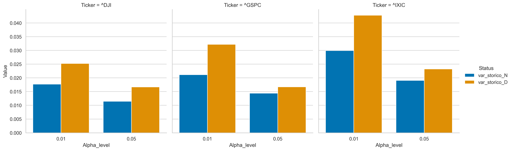
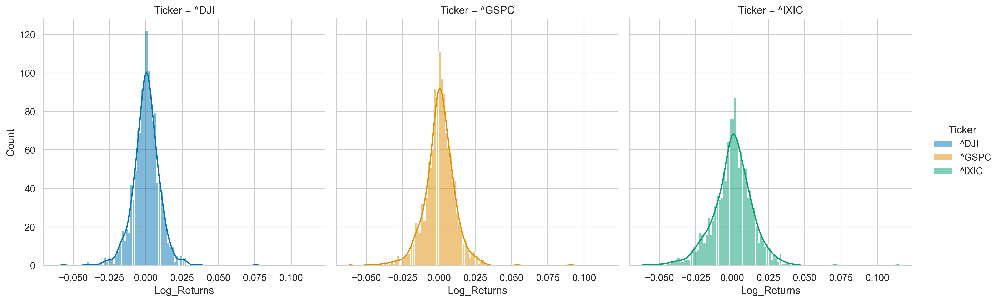
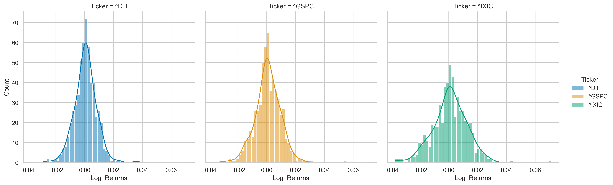
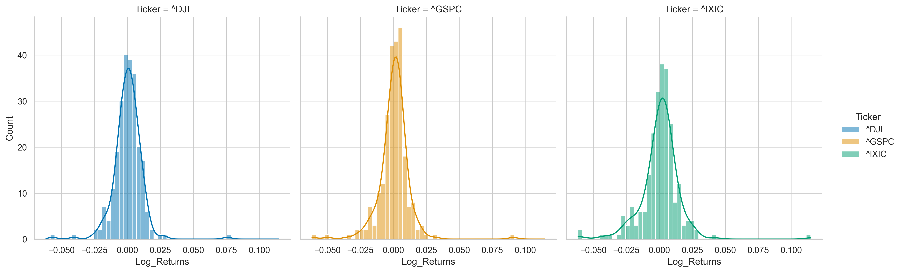

# Market Risk Dynamics: 2025 Tariff Shock Analysis
**Comparative Risk Assessment of S&P500, Dow Jones, and Nasdaq using Backtested VaR & Expected Shortfall.**

# Sommario

1. [Executive Summary](1#executive-summary)
2. [Key Features](#2-key-features)
3. [Metodologia Tecnica](#3-metodologia-tecnica)
4. [Risultati Principali](#4-riultati-principali)
5. [Conclusioni e limiti](#5-conclusioni-e-limiti)

## 1. Executive Summary
L'analisi esamina l'impatto sistemico dell'annuncio sulle tariffe doganali del 2 Aprile 2025 ([www.whitehouse.gov](https://shorturl.at/IayVw)) sulla volatilità e sulla struttura delle code dei principali indici USA. Attraverso una metodologia di **Event Study**, si quantifica il fallimento della capacità predittiva dei modelli di rischio storici durante fasi di *break* del ciclo macroeconomico.

## 2. Key Features
- **Multi-Index Pipeline:** Download automatizzato via `yfinance` e processing vettoriale dei log-returns.
- **Dynamic Data Slicing:** Implementazione di finestre mobili per la calibrazione (Estimation Window) e il backtesting (Event Window).
- **Non-Parametric Risk Metrics:** Calcolo del Historical Value-at-Risk ($VaR$) e Conditional VaR / Expected Shortfall ($ES$).
- **Statistical Validation:** Backtesting mediante il **Kupiec POF (Proportion of Failures) Test** per la verifica della robustezza del modello.

## 3. Metodologia Tecnica
- **Estimation Window:** 600 osservazioni (regime di volatilità pre-evento).
- **Gap Period:** 15 giorni per isolare l'effetto annuncio da rumore di breve termine.
- **Event/Distress Window:** 240 osservazioni post-evento.
- **Confidence Levels:** $\alpha = 0.01, 0.05$.
- **Hypothesis Testing:** Il test di Kupiec è stato calibrato su un livello di confidenza del 99% per identificare derive sistematiche del modello (Model Drift).

## 4. Riultati Principali

L'evidenza empirica mostra un incremento asimmetrico del rischio. Mentre il NASDAQ (^IXIC) e l'S&P500 (^GSPC) mostrano una tenuta statistica (p-value > 0.01), il Dow Jones (^DJI) evidenzia una **violazione critica del modello** (p-value=0.001028).

### Risultati test di Kupiec
| **Ticker** | **^DJI** | **^GSPC** | **^IXIC** 
|------------|----------|-----------|-----------
| Violazioni |  9.00    |   7.00    |   6.00 
| p-value    | 0.001028 | 0.01535   | 0.049737  

La divergenza tra gli indici è critica. Il p-value dello 0.001 sul Dow Jones (^DJI) indica un **model failure**. Dal punto di vista finanziario, questo riflette la vulnerabilità del settore industriale (blue chips) alle **barriere commerciali**, che ha generato un numero di violazioni (9) statisticamente incompatibile con un livello di confidenza del 99%.

**Interpretazione risultati:**

**Sensibilità Settoriale**: Il fallimento del VaR sul DJI suggerisce che lo shock tariffario ha colpito in modo sproporzionato il **settore industriale** e le **"Blue Chips"**, storicamente meno volatili, inducendo un aumento delle violazioni superiore alla capacità di adattamento del modello storico. Lo shift di rischiosità del s&p500 (^GSPC ) suggerisce che l'annuncio è diventato da un rischio idiosincratico a un rischio sistematico di mercato.

**Tail Risk & Forma Distribuzione**: L'incremento dell'Expected Shortfall **(+88% per l'S&P500)** è sistematicamente superiore all'incremento del **VaR (+52%)**. Questo può indicare non solo un aumento della **probabilità di perdite**, ma una significativa estensione della **severità nelle code**. Lo scenario macro del 2025 ha trasformato la distribuzione dei rendimenti, rendendo il VaR storico una misura di rischio troppo **ottimistica** nella gestione di **shock esogeni** del mercato.

### Change comparison VaR 
 **#** | **Ticker** | **0.01** | **0.05** 
-------|-----------|----------|----------
 **1** | ^DJI      | 0.425531 | 0.455642 
 **2** | ^GSPC     | 0.522981 | 0.159383 
 **3** | ^IXIC     | 0.430110 | 0.217884 

### Change comparison ES  
 **#** | **Ticker**  | **0.01** | **0.05** 
-------|-------------|----------|----------
 **1** | ^DJI        | 0.826864 | 0.557829 
 **2** | ^GSPC       | 0.880754 | 0.544965 
 **3** | ^IXIC       | 0.588299 | 0.443745 

### Change VaR comparison

*Figure 1: Comparison of VaR levels across scenarios.*

Il grafico evidenzia un shift strutturale del rischio. L'incremento del VaR al 99% è sistematicamente superiore a quello al 95%, confermando che lo shock tariffario ha impattato maggiormente i **tail events** rispetto alla **volatilità media**. Questo suggerisce una mutazione della distribuzione dei rendimenti verso una maggiore **leptocurtosi**.
&nbsp; 

### Distribuzione Rendimenti Logaritmici

*Figure 2: Log distributions by ticker.*
&nbsp; 

### Distribuzione Estimation window & Distribuzione event window

*Figure 3: Normality distributions.*
&nbsp; 

*Figure 2: Distress Window distributions.*

**Analisi della Distribuzione**: Il passaggio dalla finestra di normality a quella di distress mostra chiaramente l'insorgere di fat tails. Mentre la distribuzione pre-evento è approssimabile a una normale, il periodo post-evento presenta **outliers estremi** (fino a -6% giornaliero) che il modello storico, basato su un lookback di serie storiche, è meno reattivo e rimane più esposto a cambiamenti di mercato.

## 5. Conclusioni e Limiti

L'analisi conferma che l'annuncio tariffario del 2025 ha rappresentato un **regime shift** per i mercati USA. Il fallimento statistico del modello sul Dow Jones evidenzia i limiti intrinseci degli approcci puramente storici in presenza di shock esogeni.

### Limiti del Modello (Historical VaR)
1. **Echo Effect**: Il VaR storico risente della finestra temporale scelta; eventi estremi passati rimangono nel calcolo finché non escono dalla finestra, influenzando la stima del rischio attuale.
2. **I rendimenti**: Il modello non ha una memoria pesata. Tratta il rendimento di 600 giorni fa con la stessa importanza di quello di ieri, risultando lento nel reagire a picchi improvvisi di volatilità (volatility clustering).
3. **Impatto perdite**: Il VaR, non essendo una misura di rischio coerente, non cattura la gravità della perdita oltre la soglia, compito delegato con successo all'**Expected Shortfall** in questa analisi.

### Estensioni Future
Per superare questi limiti, il progetto potrebbe evolvere verso:
- **Filtered Historical Simulation (FHS)**: Combinare modelli GARCH per standardizzare i rendimenti e catturare la dinamica della volatilità.
- **Extreme Value Theory (EVT)**: Modellizzare specificamente le code della distribuzione tramite la distribuzione di Pareto generalizzata (GPD).
- **Monte Carlo Simulation (MCS)**: Generare scenari predittivi basati su processi stocastici (es. Geometric Brownian Motion) per includere componenti di randomicità.
